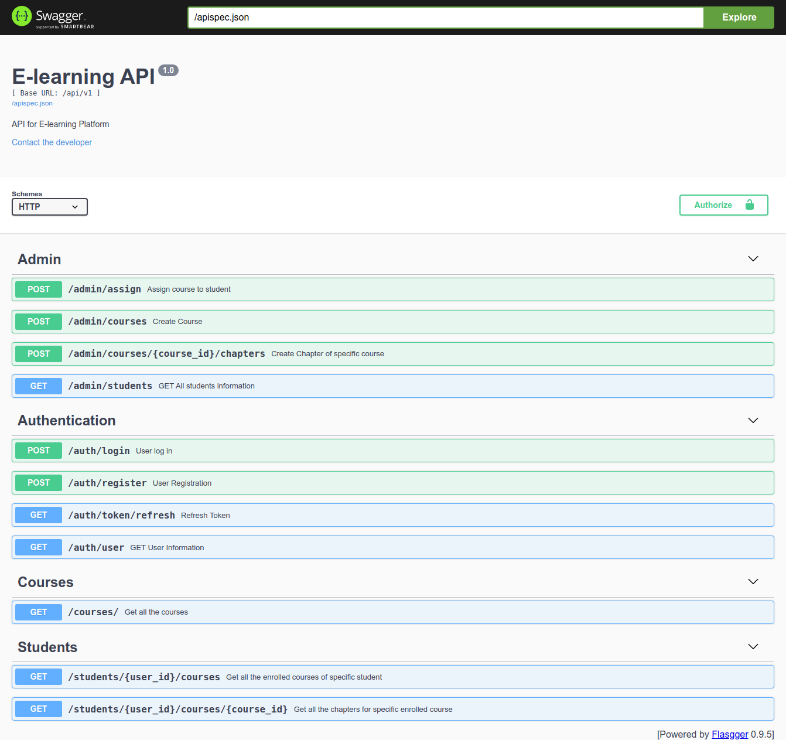

# E-learning Rest Api built with Flask

This is API of online e-learning platform built with python web framework Flask.


## Packages used to build this API 

- Flask

- Flask-SQLAlchemy

- flask-marshmallow

- marshmallow-sqlalchemy

- flasgger

- Flask-JWT-Extended

## Run Locally

Clone the project

```bash
  git clone https://link-to-project
```

Go to the project directory

```bash
  cd my-project
```

Install dependencies

```bash
  pip3 install -r requirements.txt
```

Start the server

```bash
  flask run
```

To access the API Swagger documentation, access this url in your browser:

```bash
  http://127.0.0.1:5000/
```
## Screenshots




